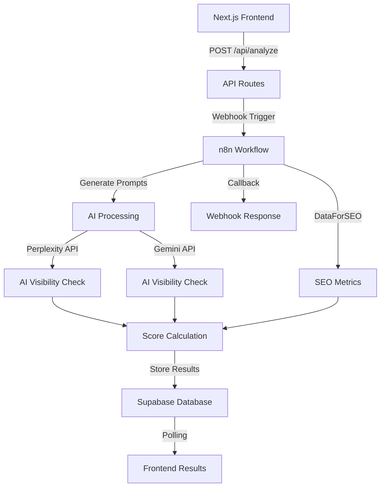

# 🚀 AI & SEO Prompt Analyzer

A sophisticated recommendation engine that analyzes prompts for AI visibility and SEO opportunities, helping businesses optimize their content strategy for both traditional search engines and AI-powered search platforms.

## Project Live at https://v0-aseo-analyser.vercel.app/


## 📋 Table of Contents
- [Overview](#overview)
- [Key Features](#key-features)
- [Architecture](#architecture)
- [Recommendation Engine Logic](#recommendation-engine-logic)
- [Tech Stack](#tech-stack)
- [n8n Workflow Pipeline](#n8n-workflow-pipeline)
- [Scoring Algorithm](#scoring-algorithm)
- [UI/UX Design](#uiux-design)
- [Installation & Setup](#installation--setup)
- [API Documentation](#api-documentation)
- [Database Schema](#database-schema)
- [Future Enhancements](#future-enhancements)

## 🎯 Overview

The AI & SEO Prompt Analyzer bridges the gap between traditional SEO and the emerging field of AI search optimization. As businesses increasingly need to optimize for AI-powered search engines like Perplexity and Google's Gemini, this tool provides actionable insights on which prompts and topics offer the highest visibility potential.

### Problem It Solves
- **AI Search Blindspot**: Most businesses don't know how their content performs in AI search results
- **SEO vs AI Optimization**: Traditional SEO tools don't measure AI visibility
- **Content Strategy Gap**: No unified scoring system for both SEO and AI opportunities
- **Resource Prioritization**: Difficulty identifying which topics deserve content investment

## ✨ Key Features

### 🤖 AI Visibility Analysis
- **Multi-Engine Support**: Analyzes citations in Perplexity and Google Gemini
- **Citation Ranking**: Tracks position and prominence in AI responses
- **First Paragraph Detection**: Identifies if content appears in opening statements
- **Consensus Scoring**: Measures agreement between different AI engines

### 📊 SEO Metrics Integration
- **Search Volume Analysis**: Real-time search volume data via DataForSEO
- **Keyword Difficulty**: Competitive landscape assessment
- **SERP Features**: Detection of featured snippets, PAA, and AI overviews
- **Trend Analysis**: Year-over-year and month-over-month trend tracking
- **Commercial Intent**: CPC and transactional probability metrics

### 🎨 Notion-Style Interface
- **Database Views**: Toggle between Overall, AI Scores, and SEO Scores views
- **Smart Tables**: Sortable, filterable data with hover states
- **Progress Visualization**: Granular processing steps with real-time updates
- **Responsive Design**: Seamless experience across all devices

## 🏗 Architecture



### Async Processing Pattern
To handle the 2.5-minute processing time and bypass Vercel's timeout limitations:
1. Frontend initiates analysis and receives session ID immediately
2. n8n workflow processes in background
3. Frontend polls for results every 5 seconds
4. Results fetched from Supabase when ready

## 🧠 Recommendation Engine Logic

### Prompt Generation Strategy
1. **Context Analysis**: Extracts domain-specific terminology and themes
2. **Intent Mapping**: Generates prompts across informational, navigational, and transactional intents
3. **Variation Creation**: Produces 10 contextually relevant prompt variations
4. **AI Optimization**: Structures prompts for maximum AI engine comprehension

### Filtering Pipeline
```
Input Prompts (5-20) → Context Enhancement → AI Visibility Check → 
SEO Opportunity Analysis → Score Calculation → Top 5 Selection
```

## 💻 Tech Stack

### Frontend
- **Framework**: Next.js 14 (App Router)
- **Language**: TypeScript 5.0
- **Styling**: Tailwind CSS
- **UI Components**: Custom Notion-style components
- **State Management**: React Hooks
- **Icons**: Lucide React

### Backend
- **Runtime**: Node.js with Edge Functions
- **Automation**: n8n (self-hosted or cloud)
- **Database**: Supabase (PostgreSQL)
- **APIs**: 
  - Perplexity AI API
  - Google Gemini API
  - DataForSEO API

### Infrastructure
- **Hosting**: Vercel (Frontend)
- **Workflow Engine**: n8n Cloud
- **Database**: Supabase Cloud
- **CDN**: Vercel Edge Network

## 🔄 n8n Workflow Pipeline

### Workflow Nodes Breakdown

#### 1. **Webhook Trigger**
- Receives domain and prompts
- Validates input data
- Generates unique session ID

#### 2. **Prompt Generation (Code Node)**
```javascript
// Generates 10 contextual prompts based on domain
// Uses AI to understand domain context
// Creates variations across different search intents
```

#### 3. **AI Visibility Check (Parallel Processing)**
- **Perplexity Branch**: 
  - Queries each prompt
  - Analyzes response for citations
  - Checks citation ranking and position
- **Gemini Branch**:
  - Similar analysis for Google's AI
  - Tracks unique ranking factors

#### 4. **SEO Metrics Collection**
- **DataForSEO Integration**:
  - Search volume data
  - Keyword difficulty scores
  - SERP feature detection
  - Trend analysis

#### 5. **Score Calculation Engine**
```javascript
// Combines AI and SEO signals
// Weights factors based on importance
// Generates recommendation reasoning
```

#### 6. **Database Operations**
- Stores all 10 analyzed prompts
- Filters top 5 by combined score
- Maintains session-based results

#### 7. **Webhook Callback**
- Notifies frontend of completion
- Triggers result display

## 📊 Scoring Algorithm

### AI Opportunity Score (0-100)
```javascript
aiScore = (
  citationPresence * 40 +      // Is domain cited?
  citationRank * 30 +           // Ranking position (1-10)
  firstParagraph * 20 +         // Appears in opening?
  engineConsensus * 10          // Agreement between engines
)
```

### SEO Opportunity Score (0-100)
```javascript
seoScore = (
  normalizedVolume * 30 +       // Search demand
  (100 - difficulty) * 15 +     // Competition inverse
  normalizedCPC * 20 +          // Commercial value
  trendScore * 20 +             // Growth trajectory
  serpFeatures * 15             // SERP opportunities
)
```

### Final Score Calculation
```javascript
finalScore = (aiScore * 0.5 + seoScore * 0.5)
// Equal weighting reflects dual importance
```

### Reasoning Engine
Generates human-readable explanations:
- "Excellent opportunity - High visibility potential"
- "Strong AI visibility across both engines"
- "High search volume (28,366) with low competition"
- "SERP features: Featured Snippet, PAA, AI Overview"

## 🎨 UI/UX Design

### Design Philosophy
- **Notion-Inspired**: Clean, minimal interface with subtle interactions
- **Information Hierarchy**: Progressive disclosure of complexity
- **Visual Feedback**: Real-time processing animations
- **Accessibility**: WCAG 2.1 AA compliant

### Key UI Components

#### Processing Animation
```jsx
// Granular sub-steps show actual workflow progress
// Real-time timer displays elapsed time
// Smooth transitions between steps
```

#### Database Views
- **Overall View**: Comprehensive metrics at a glance
- **AI Scores View**: Deep dive into AI performance
- **SEO Scores View**: Traditional search metrics focus

#### Interactive Elements
- **Hover States**: Full prompt preview on truncated text
- **Click Actions**: Detailed reasoning panel
- **Copy/Add**: Quick actions for prompt management

## 🚀 Installation & Setup

### Prerequisites
```bash
Node.js 18+
npm or yarn
Supabase account
n8n instance (cloud or self-hosted)
```

### Environment Variables
```env
# Supabase
NEXT_PUBLIC_SUPABASE_URL=your-supabase-url
SUPABASE_ANON_KEY=your-anon-key

# n8n
NEXT_PUBLIC_N8N_WEBHOOK_URL=your-webhook-url
N8N_CALLBACK_SECRET=your-secret-token

# Optional: API Keys for direct integration
PERPLEXITY_API_KEY=your-key
GEMINI_API_KEY=your-key
DATAFORSEO_API_KEY=your-key
```

### Local Development
```bash
# Clone repository
git clone https://github.com/yourusername/ai-seo-analyzer.git

# Install dependencies
npm install

# Set up environment variables
cp .env.example .env.local

# Run development server
npm run dev

# Build for production
npm run build
```

### n8n Workflow Setup
1. Import workflow template from `/n8n/workflow.json`
2. Configure credentials for APIs
3. Update webhook URLs
4. Activate workflow

### Database Setup
```sql
-- Run migrations in Supabase SQL editor
-- Tables: sessions, ai_scores, seo_scores, final_prompt_scores
-- See /database/schema.sql for complete schema
```

## 📡 API Documentation

### Start Analysis
```typescript
POST /api/analyze
{
  "domain": "example.com",
  "prompts": ["prompt1", "prompt2", ...] // Min 5, Max 20
}

Response:
{
  "success": true,
  "sessionId": "unique-session-id",
  "message": "Analysis started"
}
```

### Check Results
```typescript
GET /api/results/{sessionId}

Response:
{
  "success": true,
  "complete": true,
  "top_prompts": [
    {
      "rank": 1,
      "prompt_text": "...",
      "final_score": 92,
      "ai_opportunity_score": 99,
      "seo_opportunity_score": 85,
      "score_reasoning": "..."
    }
  ]
}
```

## 💾 Database Schema

### Core Tables

#### `sessions`
- Manages analysis sessions
- Tracks user inputs and timestamps

#### `ai_scores`
- Perplexity citation data
- Gemini visibility metrics
- Consensus calculations

#### `seo_scores`
- Search volume and trends
- Keyword difficulty
- SERP features
- Commercial metrics

#### `final_prompt_scores`
- Combined scoring results
- Top 5 recommendations
- Reasoning and insights

## 🔮 Future Enhancements

### Planned Features
- **Additional AI Engines**: Claude, ChatGPT search integration
- **Competitor Analysis**: Compare domain visibility against competitors
- **Historical Tracking**: Monitor visibility changes over time
- **Bulk Analysis**: Process multiple domains simultaneously
- **API Access**: RESTful API for programmatic access
- **Export Options**: CSV, PDF reports
- **Custom Weighting**: Adjustable scoring parameters

## 📄 License

MIT License - See [LICENSE](LICENSE) file for details

---

**Built with ❤️ for the future of search optimization**
